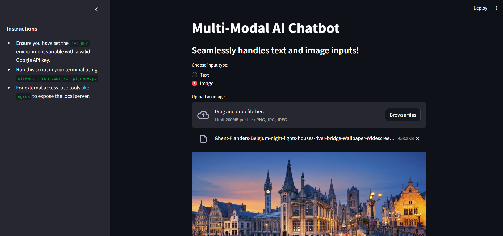
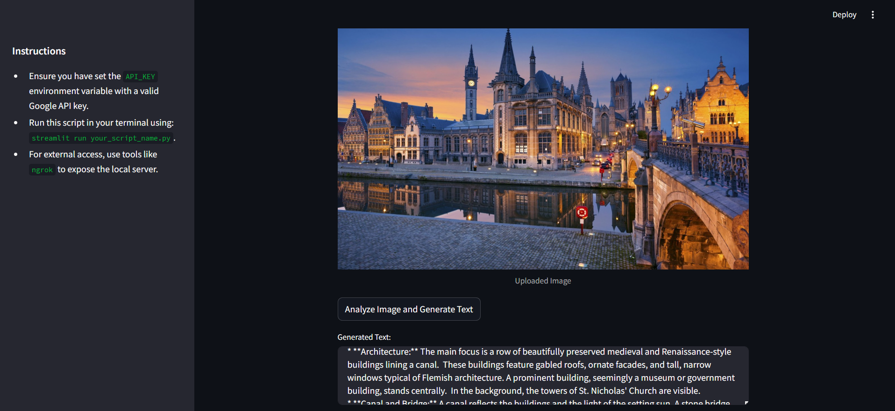
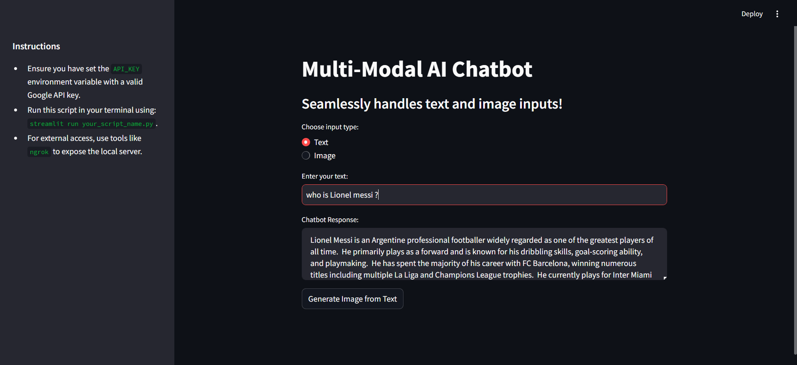

### Developed a multi-modal chatbot Explanation and Extended the chatbot to handle and generate both text and image content using Google Palm and Gemini AI capabilities. 

#### It is a chatbot that can understand image inputs, generate relevant images, and seamlessly integrate visual and textual information in conversations.

##### Here is the model pictures

##### Since there is a issue with gemini not supporting image generation and deprecated PALM api support. Only the text to text, image to text content generation is supported in this model. 

##### In future if there is a model that supports image generation part, then we can replace this model.